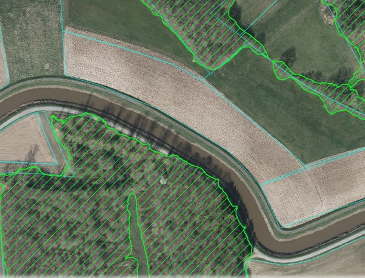

# Orthophoto segmentation

A python package that makes it (relatively) easy to segment orthophotos. Any type of
georeferenced images should work, e.g. satellite, aerial or drone images, (historical)
maps, hillshades,...

No programming is needed, everything is managed via configuration files.

The typical steps:
1. create a training dataset for a topic of your choice, e.g. in QGIS
2. train a neural network to segment orthophotos
3. run the segmentation on a larger area + vectorize the result
4. apply some basic postprocessing like dissolve, simplify,...

Only open source software is needed, eg. QGIS and tensorflow.

Installation and usage instructions can be found in the [orthoseg docs](https://orthoseg.readthedocs.io)

As an example, this is an example of how the output of a tree detection on aerial images
could look:

