========
Examples
========

This pages shows some examples of segmentations that were created using orthoseg.

Ditches
-------
A POC of a segmentation of ditches using 0.25 m/pixel resolution hillshade and skyview
data. The data is not available publicly at the moment.

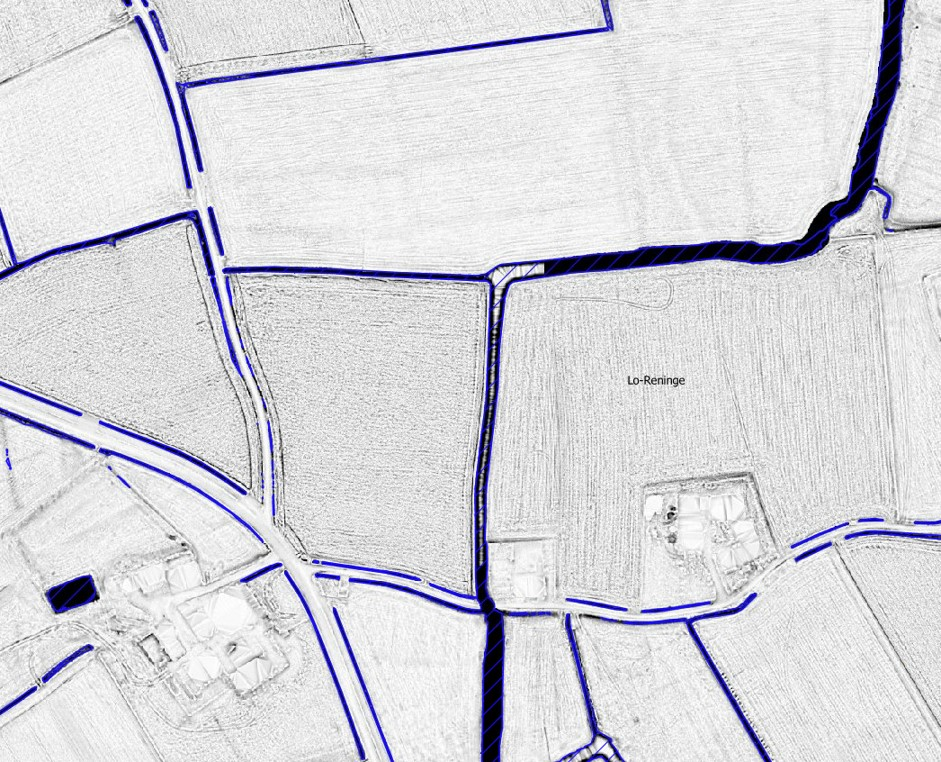

Fruit
-----
A segmentation of fruit plants on aerial imagery of 0.25 m/pixel resolution.
Main objective is to detect low stem fruit trees, but the training dataset also contains
samples of berry bushes, grapevines and hop plants. High stem fruit trees are not
included. The data is not available publicly at the moment.

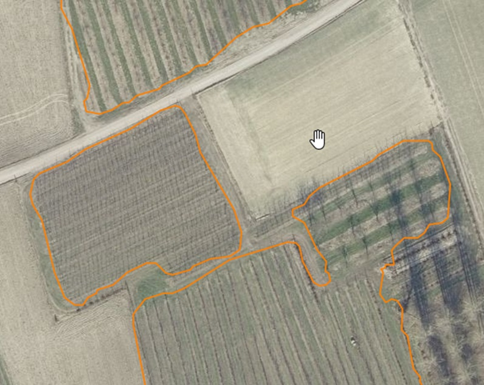

This is an overview of the fruit segmentation of the Flemish region in Belgium.

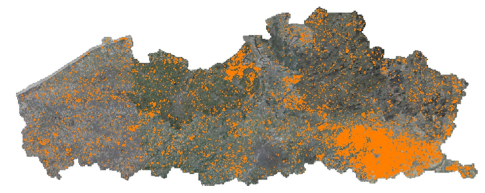

Gardens
-------
A segmentation of gardens on orthophotos with 0.25 m/pixel resolution. Qualisty is not
consistent everywhere due to the high variability in garden appearance.
The data is not available publicly at the moment.

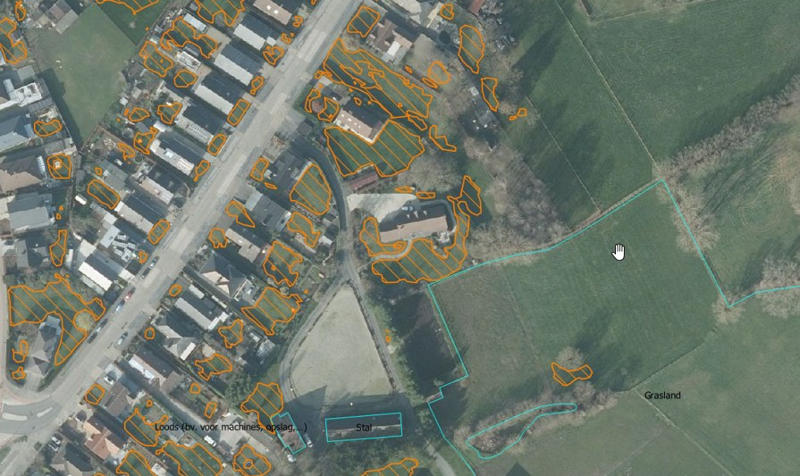

Greenhouses
-----------
A segmentation of greenhouses on orthophotos with 0.25 m/pixel resolution. Temporary
and permanent greenhouses are detected as seperate classes.
The data is not available publicly at the moment.

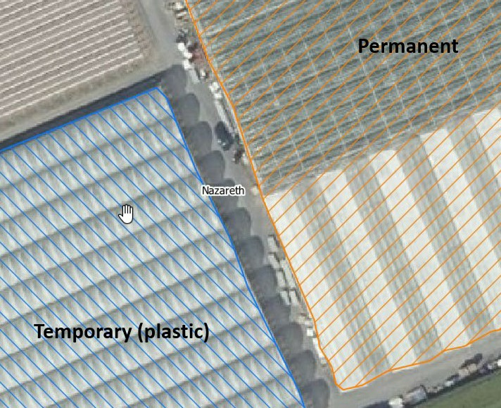

Historic land use (Ferraris map, ~1778)
---------------------------------------
A segmentation of historic land use. About 15 different uses are detected as seperate
classes (e.g. arable land, grassland, forest, roads, buildings, water bodies, etc.).
The map used is the Ferraris map created from 1771-1778.

The data is publicly available
`here <https://www.vlaanderen.be/datavindplaats/catalogus/digitalisatie-historisch-landgebruik-en-landgebruiksveranderingen-in-vlaanderen-1778-2022>`_.

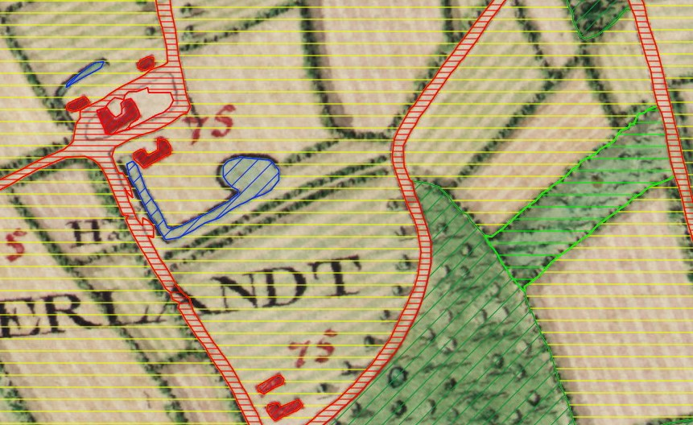

Historic linear features (Ferraris map, ~1778)
----------------------------------------------
A segmentation of historic linear features (e.g. rows of trees, hedgerows, rivers).
The map used is the Ferraris map created from 1771-1778.

A derivative of this segmentation can be found
`here <https://www.vlaanderen.be/datavindplaats/catalogus/bomenrijen-ferraris-1771-1778>`_.

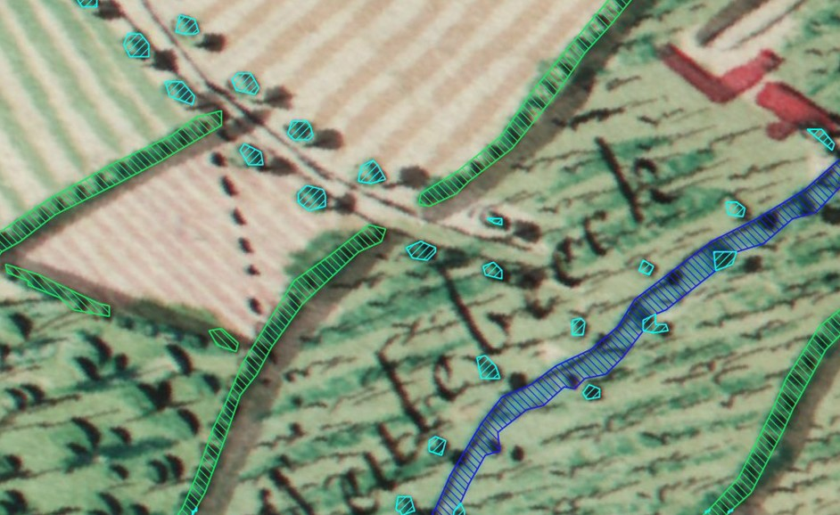

Historic point features (Ferraris map, ~1778)
---------------------------------------------
A segmentation of historic point-based information (e.g. water mills, wind mills,
churches, chapels, etc.). The map used is the Ferraris map created from 1771-1778.
The data is not available publicly at the moment.

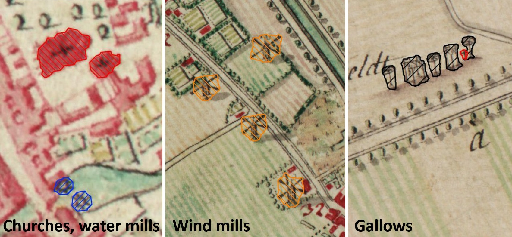

Horse pastures
--------------
A segmentation of horse pastures on orthophotos with 0.25 m/pixel resolution. The data
is not available publicly at the moment.

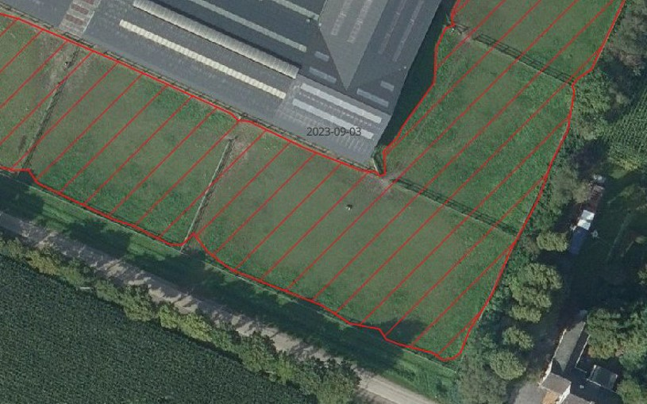

Another typical type of horse pastures, that is also being detected as horse pastures,
are paddocks:

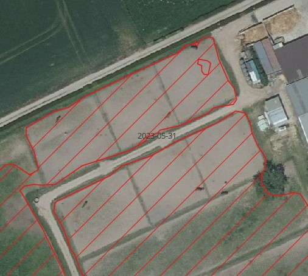

Horse tracks
------------
A segmentation of horse tracks on orthophotos with 0.25 m/pixel resolution. The data
is not available publicly at the moment.

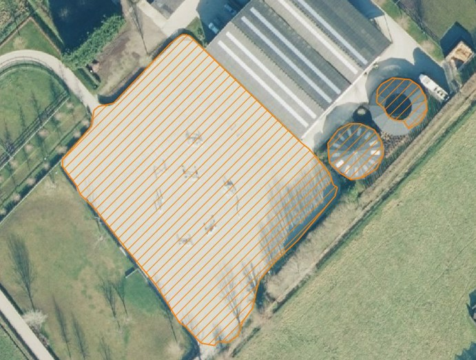

Recreation fields
-----------------
A segmentation of recreation fields (e.g. soccer fields, tennis courts, etc.) on
orthophotos with 0.25 m/pixel resolution. The data is not available publicly at the
moment.

Here some examples of sport fields being detected:

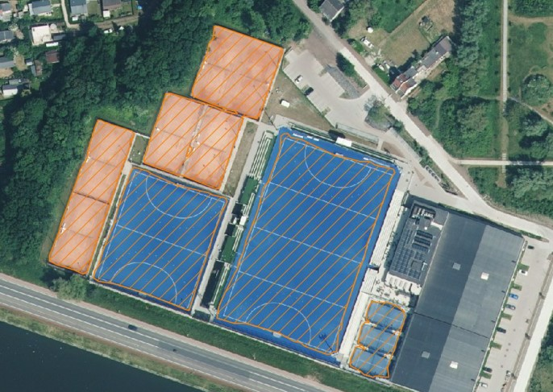

This is an example of a golf course being detected:

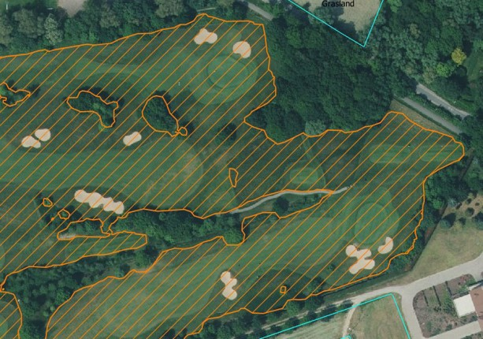

Sealed surfaces
---------------
A segmentation of sealed surfaces (e.g. roads, parking lots, buildings, etc.) on
orthophotos with 0.25 m/pixel resolution. The data is not available publicly at the
moment.

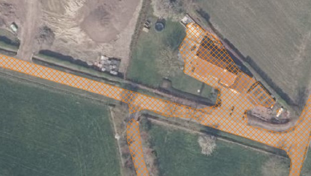

Tree crown segmentation
-----------------------
A segmentation of tree crowns on orthophotos with 0.25 m/pixel resolution.
The data is not available publicly at the moment.

.. image:: _static/images/trees.jpg
   :alt: Segmentation of tree crowns

Vegetable gardens
-----------------
A segmentation of (private use) vegetable gardens on orthophotos with 0.25 m/pixel
resolution.
The data is not available publicly at the moment.

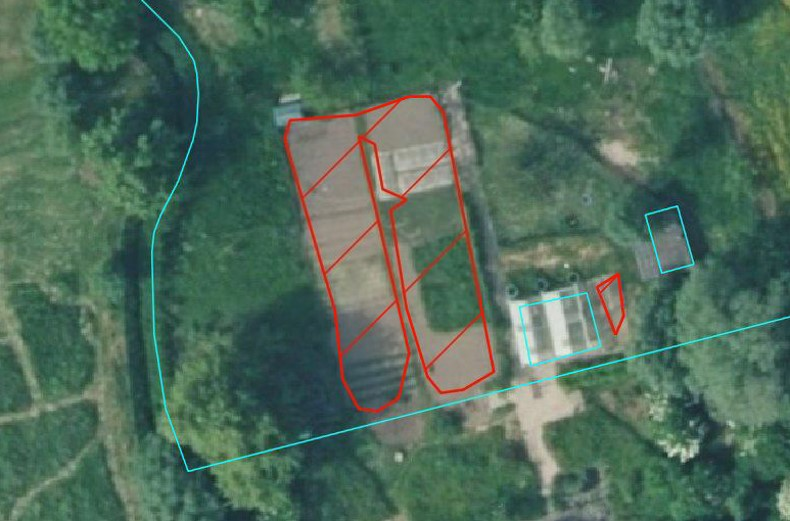

Water bodies
------------
A segmentation of water bodies on orthophotos with 0.25 m/pixel resolution.
The data is not available publicly at the moment.

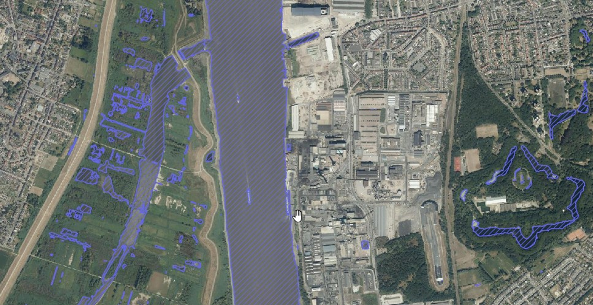

Woody landscape features
------------------------
This is actually a product created by postprocessing the tree crown segmentation,
by using GIS analysis to distinguish isolated trees, rows of trees/hedgerows,
groups of trees, forest edges and forests.

.. image:: _static/images/woody_landscape_features.jpg
   :alt: Segmentation of woody landscape features
